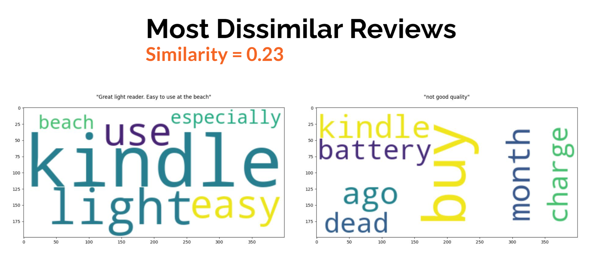

# [Capstone Project](https://github.com/ianhaggerty/finalCapstone/tree/master) — [NLP Applications](https://medium.com/@mohamadhasan.sarvandani/top-applications-of-nlp-54834ca9c8ca)

## [CoGrammar](https://skills.cogrammar.com/) / [HyperionDev](https://www.hyperiondev.com/) / [Portfolio](https://www.hyperiondev.com/portfolio/IH23120012475/)

## Introduction

This repository represents the final capstone project in my _HyperionDev Data Science (Fundamentals)_ course. The main script can be found [here](https://github.com/ianhaggerty/finalCapstone/blob/master/sentiment_analysis.py) and corresponding
notebook [here](https://github.com/ianhaggerty/finalCapstone/blob/master/notebooks/sentiment_analysis.ipynb).

The objective of this project was to discover interesting and actionable insights within a dataset of [amazon reviews](https://www.kaggle.com/datasets/datafiniti/consumer-reviews-of-amazon-products).

[spaCy](https://spacy.io/usage) was used to conduct NLP analysis, in conjunction with
[TextBlob](https://textblob.readthedocs.io/en/dev/) to determine the sentiment and subjectivity.

Please see the [project requirements](https://github.com/ianhaggerty/finalCapstone/blob/master/reports/project_desc.pdf) and corresponding [report](https://github.com/ianhaggerty/finalCapstone/blob/master/reports/sentiment_analysis_report.pdf).

My grading, by Kenneth Mlimi, can be found [here](https://hyperiondev.cogrammar.com/review/acab9271caa0636a51999e66651876b5c291f15c631ac3141e313abae0620aa8/).

## Images




## Usage

1.  Setup the virtual environment.

    ```bash
    python -m venv venv
    ```

2.  Activate the virtual environment.

- Windows:

  ```shell
  venv\Scripts\activate
  ```

- Unix or MacOS:
  ```bash
  source venv/bin/activate
  ```

3. Install the requirements.

   ```bash
   pip install -r requirements.txt
   ```

4. Run the main script.
   ```bash
   python sentiment_analysis.py
   ```
   (Optional) run the notebook.
   ```bash
   jupyter nbconvert --execute --to notebook --inplace notebooks/sentiment_analysis.ipynb
   ```

## A Note from the Author

Thanks for your interest! Please see my [GitHub](https://github.com/ianhaggerty) or [Linkedin](https://www.linkedin.com/in/ihaggerty/) to stay updated.
